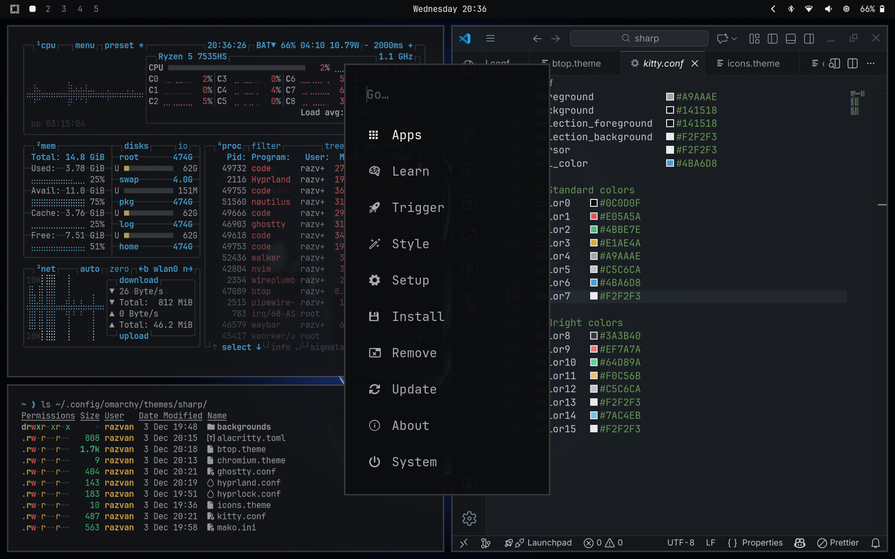

# Omarchy Noir Theme

A sleek, neutral and modern dark theme built for Omarchy.

</img>

## Installation

To install this theme use the `omarchy-theme-install` command:

```bash
omarchy-theme-install https://github.com/sauciucrazvan/omarchy-noir-theme
```

## Credits

[neovim theme (carbonfox)](https://github.com/EdenEast/nightfox.nvim) • [vscode theme (dark+ modern)](https://marketplace.visualstudio.com/items?itemName=gantoreno.dark-plus-modern)